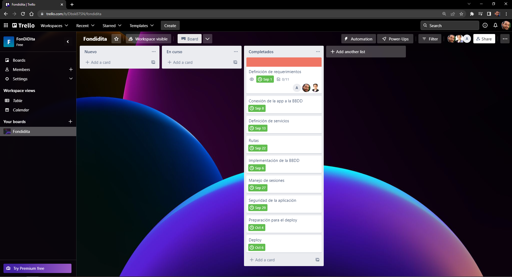
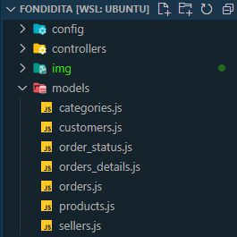
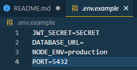
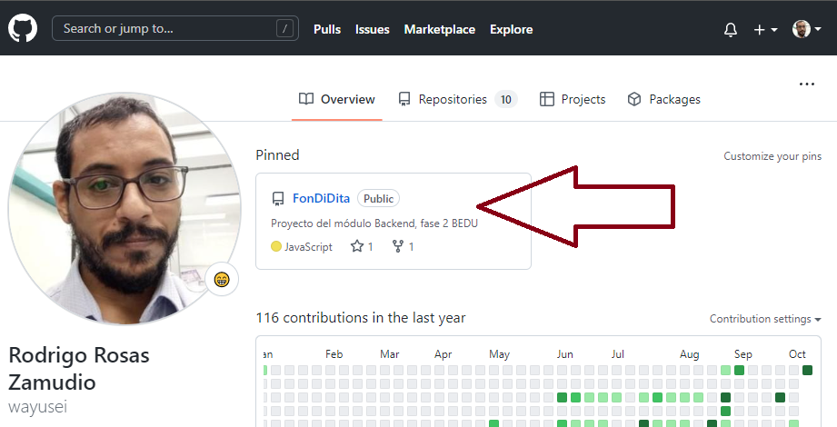
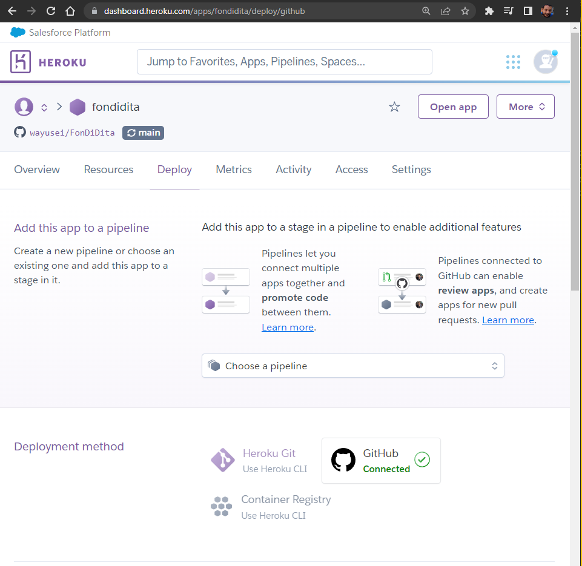
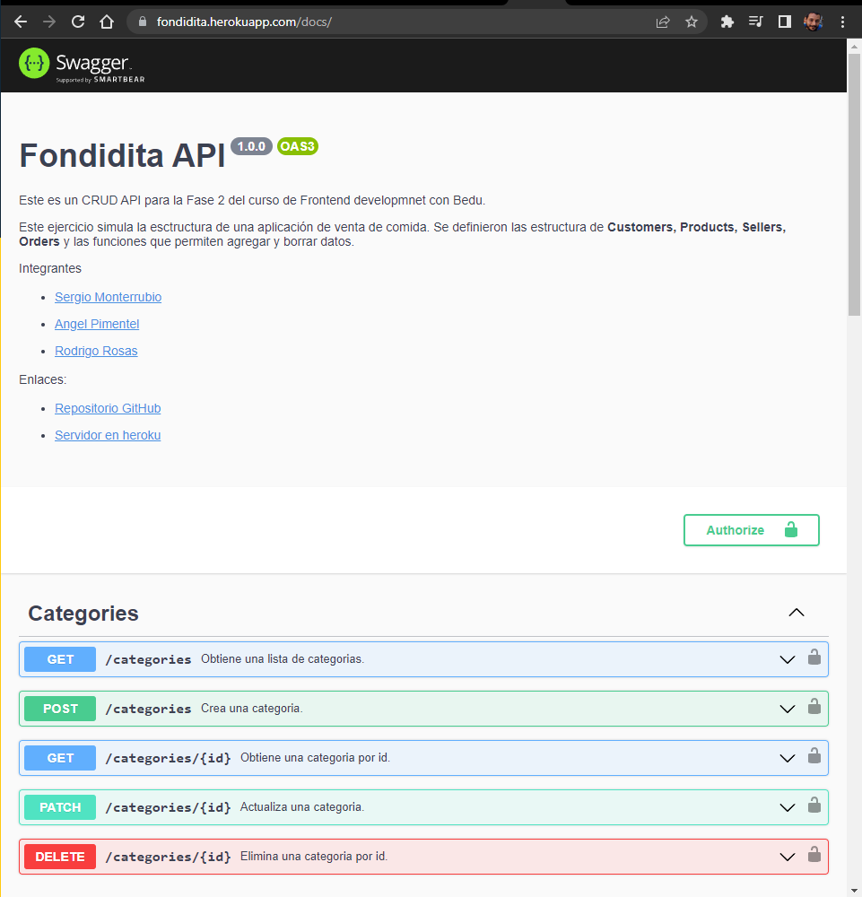

# FonDiDita

*Evaluación del módulo Backend Fundamentals, Desarrollo Web | Santander Universidades*

## Entregables Postwork 1

### Objetivos generales
 
  
### Tablero en Trello

 https://trello.com/invite/b/Dbsk87SN/3173285b96dfddc3d4848424566af0ee/fondidita
  
 

### Definición de herramientas 

Se generó una imagen utilizando el app Terrastruct (https://app.terrastruct.com/)

 

 Herramientas utilizadas: ¿Qué son y para qué sirven?

 - PostgreSQL: Es un sistema de código abierto de administraciòn de bases de datos del tipo relacional y no relacional, gratuito con data types avanzados y permite ejecutar optimizaciones de rendimiento avanzadas como si fuera un sistema de base de datos comercial.
  
 - JavaScript: Es un lenguaje de programaciòn ligero, interpretado, o compilado ‘justo-a-tiempo’ (just-in-time) con funciones de primera clase, basado en prototipos, multiparadigma, de un solo hilo, dinámico, con soporte para POO, imperativa y declarativa.Sirve para scripting en páginas web, en entornos fuera del navegador como Node.js, Apache CouchDB y Adobe Acrobat.
  
 - Node.js: Es un entorno de ejecución para Javascript construido con V8, motor de Javascript de Chrome, es open source, multiplataforma y se ejecuta del lado del servidor, sirve para crear sitios web dinámicos muy eficientes usando JS.

 - npm: NPM corresponde a las siglas de Node Package Manager, manejador de paquetes de node, sirve para compartir e instalar paquetes de software entre distintos proyectos que utilicen Node.JS.

 - Sequelize: Es un ORM, Object-Relational Mapping - mapeo objeto-relacional, sirve para manipular varias bases de datos SQL de una manera bastante sencilla, utilizando JS en este caso.

 - Express.js: Es un framework backend minimalista, diseñado para construir una aplicación de manera ágil, sirve para proporcionar funcionalidades como el enrutamiento, opciones para gestionar sesiones y cookies, etc.
  
 - Github: Es un portal creado para alojar el código de las aplicaciones de cualquier desarrollador que utiliza el sistema de control de versiones Git, es multiplataforma y tiene multitud de interfaces de usuario, sirve para que los desarrolladores suban el código de sus aplicaciones y herramientas.
  
 - Heroku: Es una plataforma de servicios en la nube (PaaS, Platform as a Service) que permite manejar los servidores y sus configuraciones, escalamiento y la administración.
  
 - Además utilizamos para comunicarnos la plataforma de videoconferencias Zoom, la aplicación de mensajería instantánea WhatsApp, la aplicación Trello y la plataforma Google Drive para mediante un documento compartido apoyarnos a la redacción de este documento.

### Historias de usuario

Las historias de usuario que se definieron fueron las siguientes:

- *Como* negocio *quiero* ver la lista de clientes que tengo *para* ofrecerles promociones.
- *Como* negocio *quiero* ver la lista de productos que ofrezco *para* editarla si es necesario.
- *Como* cliente *quiero* ver que hay en mi orden de compra *para* saber cuántos platillos estoy comprando.
- *Como* cliente *quiero* ver el estatus de mi orden *para* saber si ya me la entregarán.
- *Como* vendedor *quiero* poder gestionar los platillos que yo subí *para* poder actualizarlos o cambiarlos.
- *Como* cliente *quiero* poder ver los platillos por categoría *para* ir directo al tipo de platillo que quiero comprar.

### Identificación de los modelos del proyecto
#### Cada uno con sus caracteísticas específicas, dentro de una arquitectura MVC

## Entregables Postwork 2

1. Definir diagrama ERD ✔

2. Crear proyecto en plataforma Heroku ✔
   
   

3. Agregar Add-on Heroku postgres ✔  
   
4. Conectar usando PGAdmin4 al servidor de Heroku ✔
   
   
5. Traducir modelo relacional a esquema de base de datos ✔
   
6. Utilizar Mockaroo para generar un dataset y poblar la base de datos con él. ✔
   
   Después de la carga:
   
7. Escribir al menos 5 consultas a tu base de datos en donde se usen los conceptos vistos en la sesión y el nuevo conocimiento del postwork. ✔

## Entregables Postwork 3

- Generar el esqueleto del proyecto ✔
  
- instalar dentro de proyecto todas las dependencias y paquetes necesarios para que funcione correctamente. ✔
  
- Utilizar las credenciales de Heroku para la base de datos de tu proyecto, en el archivo app.js para la conexión con la base de datos. ✔
- Probar la conexión haciendo las consultas que se definieron en la sesión 2 a través de sequelize. ✔

## Entregables Postwork 4

1. Define la configuración de Express en el archivo app.js de tu proyecto (en equipo) de la misma forma que se hizo en el work para el proyecto BeduShop. ✔

2. Verifica que funcione correctamente corriendo tu proyecto y haciendo una peticion GET a la URL base desde Insomnia. ✔
3. Selecciona una de las tablas de la base de datos de tu proyecto y define el CRUD completo para esa entidad. ✔
4. Prueba los servicios que realizaste en el inciso anterior. ✔
5. Define un nuevo servicio GET que sea una búsqueda por ID (o el campo de llave primaria) ✔
6. Pruébalo en Insomnia. ✔
7. Define un servicio que sólo traiga ciertos campos de la tabla, estos campos deben ser seleccionados por el cliente y pasados en la petición.
8. Prueba el servicio del inciso anterior. ✔
9.  Haz capturas de pantalla/graba tu pantalla a modo de evidencias y compártelas en el canal de Slack de tu grupo. De igual manera, consérvalas para presentar tu entregable en el Checkpoint. ✔

### ¿Qué pasaría si seguimos definiendo todos los servicios en el archivo app.js?
 
El archivo se volvería muy extenso y difícil de mantener a la larga.🍝
 

### ¿Crees que representa un problema?¿Por qué?
 
Representa un problema de malas prácticas al no utilizar el patrón de diseño MVC y la modularidad que nos brinda para un código más limpio y legible.
 

## Entregables Postwork 5

- Reestructurar el código del proyecto usando los directorios definidos para controladores y modelos.✔
- Definir un router para cada una de las entidades del proyecto. ✔
- Crear un archivo routers/index.js y agregar la configuración de los routers definidos. ✔
- Agregar la configuración de router al archivo app.js del proyecto para que funcionen los endpoints definidos. Recuerda poner en la URL base la versión actual del proyecto v1. ✔
  

## Entregables Postwork 6
1. Instala el paquete crypto en tu proyecto personal. ✔
2. De todos los datos presentes en tu base de datos identifica aquellos que sean sensibles o que no deberían ser guardados de forma plana. ✔
3. Utilizando la investigación realizada en el prework de la sesión elige cual es el mejor método para proteger estos datos. ✔
4. Utiliza la biblioteca crypto para proteger los datos sensibles de la base de datos. ✔

## Entregables Postwork 7 (opcional) 👀🚧
1. Definir la configuración de Passport para tu proyecto. Puedes usar una muy similar a la vista en el work para BeduShop.
2. Controlar el acceso a los servicios de tu API para que solo los usuarios autorizados puedan acceder a ellos. Para esto considera:
   - Definir un conjunto de servicios públicos y un de servicios privados.
   - Definir un control de acceso a información o filtros de control sobre la información que regresa el servicio según el nivel del usuario que lo consulta.
   - Definir un organigrama con privilegios bien definidos para cada tipo de usuario.
3. Cambiar las rutas de los servicios que sean necesarios para modelar este control de acceso.

## Entregables Postwork 8
1. Definir las variables de entorno necesarias para ocultar la información confidencial de la aplicación en un archivo (env.sh). ✔
2. Crear las variables en la computadora y probar que la aplicación funcione correctamente de forma local. ✔  
   

3. Crear un repositorio de GitHub con el código de la aplicación.  Recuerda no subir datos de conexión ni el archivo de definición de las variables de entorno (env.sh). ✔
   
4. Usando Heroku, en el mismo proyecto donde tienes la base de datos, deberás hacer deploy de la aplicación por medio del repositorio de GitHub. ✔
   
5. Probar los servicios de tu aplicación en producción. ✔
   
6. Crear un Swagger con la documentación de los servicios.✔
   

# Integrantes del equipo de FonDiDita  👨‍💻👨‍💻👨‍💻

- Sergio Monterrubio
- Ángel Pimentel
- Rodrigo Rosas
- Julio Alberto Hernández

## Visitar la app en Railway: [Fondidita-m3](enlace...)

